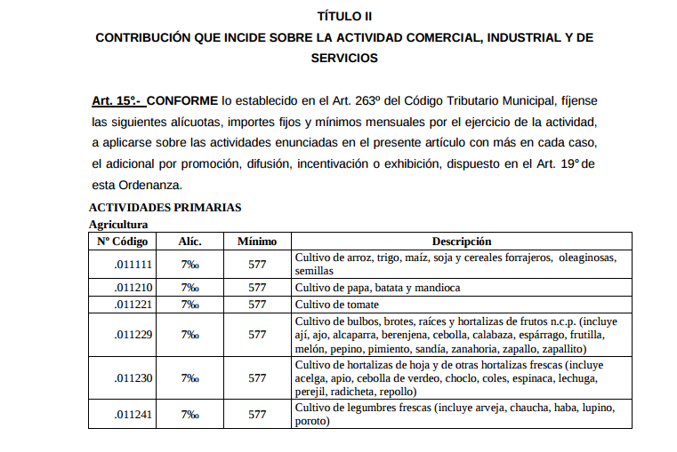

# Ordenanza Tarifaria Anual Ciudad de Córdoba

OTA. Códigos de actividades comerciales de la Ciudad de Córdoba.  
Basado en la [Ordenanza 1261](datos/ord-12621-ota-2017.pdf).  
  
[Ver como sitio web](https://modernizacionmunicba.github.io/ordenanza-tarifaria-anual-ciudad-de-cordoba/)
  

Además de algunos regímenes especiales, la mayoría de los comercios se registran para el pago de tributios en [actividades comerciales (son 948 para 2017)](datos/ActividadesOTA-2017.csv) que tienen [_Ramas de actividad_](datos/RamasDeActividad-2017.csv) y [_Categorías_](datos/CategoriasDeActividad-2017.csv) que las agrupan.  

Además los comercios tienen tipos:

 - 1 Pequeño (No presentan DDJJ)
 - 2 Medianos
 - 3 Grandes Contribuyentes
 - 4 Contribuyentes de Interés Fiscal (entre los tipos 2 y los grandes)
 - 5 Profesionales
